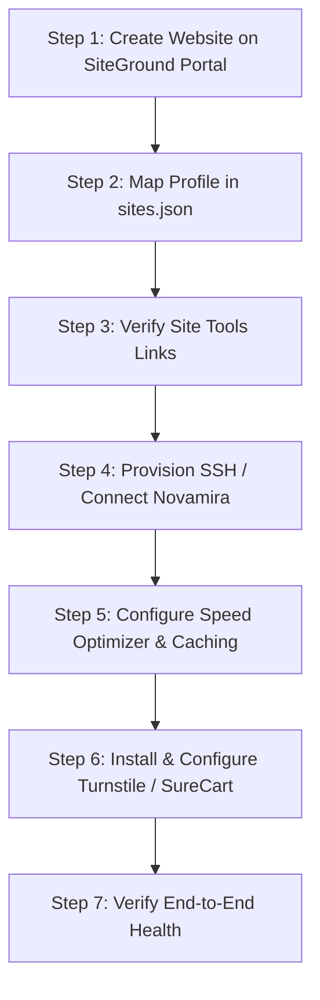

# SiteGround WordPress Site Onboarding & Provisioning Runbook

This runbook documents the standard, production-grade onboarding workflow for creating, configuring, and connecting new WordPress sites on SiteGround. It serves as the single operational contract for current and future agents to avoid fragmented scripts, ghost logic, and configuration drift.

---

## 1. Domain Strategy: Temporary vs Custom Domain

SiteGround offers two onboarding paths for shared-host WordPress sites:
1. **Temporary Domain (`<subdomain>.sg-host.com`)**:
   - **Recommended for initial onboarding, staging, and client reviews.**
   - Enables agents to scaffold themes, install plugins, construct portfolios, and verify checkout flows without touching production DNS or waiting for nameserver propagation.
   - When ready for launch, SiteGround's Site Tools provides a 1-click "Change Primary Domain" flow, followed by a WP-CLI `wp search-replace`.
2. **Custom Domain**:
   - Used when DNS is already managed or ready to be pointed immediately.
   - DNS routing is managed via `cloudflare-dns-manager`.

---

## 2. Step-by-Step Onboarding Spine



### Step 1: Create Website on SiteGround Portal
1. Navigate to SiteGround Client Area -> **Websites** -> **New Website**.
2. Choose **Temporary Domain** (e.g. `vectory44.sg-host.com`) or enter custom domain.
3. Select **Start New Website** -> **WordPress**.
4. Set Administrator email, username, and generate a strong password (backed up to 1Password).
5. Skip optional upsells (SiteGround Site Scanner, etc.).
6. Complete creation and obtain the opaque provider **`siteId`** (visible in Site Tools URL query parameter `?siteId=...`, e.g. `Smd2emFuc09KZz09`).

---

### Step 2: Register Site in `~/.config/siteground-ops/sites.json`
Every site profile MUST contain non-secret pointers only:

```json
{
  "sites": {
    "<site-id>": {
      "adapter": "novamira_mcp",
      "credential_pointer": "novamira-ops mcp_config: novamira-<slug>",
      "environment": "staging",
      "label": "Human Readable Label",
      "novamira_server": "novamira-<slug>",
      "portal_account": "primary-siteground",
      "portal_site_id": "<exact-provider-site-id>",
      "public_url": "https://<domain>",
      "recovery_pointer": "SiteGround provider backup before any future mutation"
    }
  }
}
```

Verify profile validity:
```bash
siteground-ops sites
```

---

### Step 3: Verify Site Tools Links
Run `portal links` to verify exact URLs to Site Tools features:
```bash
siteground-ops portal links <site-id>
```
Expected evidence includes:
- `dashboard`: `https://tools.siteground.com/dashboard?siteId=<id>`
- `ssh`: `https://tools.siteground.com/ssh?siteId=<id>`
- `cache`: `https://tools.siteground.com/cacher?siteId=<id>`
- `file_manager`: `https://tools.siteground.com/filemanager?siteId=<id>`
- `backups`: `https://tools.siteground.com/backup-restore-manage?siteId=<id>`
- `wordpress_management`: `https://tools.siteground.com/wp-manage?siteId=<id>`
- `wordpress_admin`: `https://<domain>/wp-admin/`

---

### Step 4: Provision SSH / Connect Novamira

#### Option A: Novamira MCP Transport (Default for Agentic Ops)
1. In WordPress Admin (`siteground-ops wp-admin <site-id>`), ensure `novamira` and `novamira-pro` plugins are active.
2. In WordPress Admin -> Users -> Profile, create an **Application Password** named `novamira-agent`.
3. Register the server in `~/.gemini/antigravity/mcp_config.json`:
   ```json
   "novamira-<slug>": {
     "command": "node",
     "args": ["/path/to/mcp-wordpress-remote/dist/index.js"],
     "env": {
       "WP_API_URL": "https://<domain>/wp-json",
       "WP_API_USERNAME": "<admin_username>",
       "WP_API_PASSWORD": "<application_password>"
     }
   }
   ```
4. Verify readback:
   ```bash
   siteground-ops doctor <site-id>
   siteground-ops inventory <site-id>
   ```

#### Option B: SSH Key Provisioning
1. Navigate to Site Tools -> **Devs** -> **SSH Key Manager** via the link from `siteground-ops portal links <site-id>` (`https://tools.siteground.com/ssh?siteId=<id>`).
2. Import or create an ed25519 public key (e.g. `id_ed25519.pub`).
3. Click "Manage SSH Key" -> "SSH Credentials" to copy:
   - **Host / IP**: e.g. `sgp28.siteground.asia` or `gsgpm1058.siteground.biz`
   - **Port**: `18765` (SiteGround standard port)
   - **Username**: e.g. `u3689-vsu0bhq89y4c`
4. Add host to `~/.ssh/config` with `IdentitiesOnly yes` and `IdentityAgent none` to prevent multi-key auth failures.

---

### Step 5: Speed Optimizer & Caching Configuration

SiteGround uses an Nginx reverse proxy cache ("SuperCacher") combined with the `sg-cachepress` (Speed Optimizer) WordPress plugin.

1. **Verify Caching via WP-CLI**:
   ```bash
   wp sg optimize dynamic-cache enable
   wp sg optimize file-cache enable
   wp sg optimize autoflush-cache enable
   ```
2. **Purge Cache**:
   ```bash
   wp sg purge
   ```
3. **Verify Public Cache Headers**:
   ```bash
   curl -ILs https://<domain>/ | grep -iE 'x-proxy-cache|server|sg-f-cache'
   ```
   Expected response:
   ```http
   server: nginx
   x-cache-enabled: True
   x-proxy-cache-info: DT:1
   ```

---

### Step 6: Security, Spam Protection & Commerce Setup

1. **Cloudflare Turnstile**:
   - Install and activate plugin:
     ```bash
     wp plugin install simple-cloudflare-turnstile --activate
     ```
   - Configure in WP Admin -> Settings -> Cloudflare Turnstile.
   - Recommended settings:
     - Theme: Auto
     - Language: Auto-detect
     - Appearance mode: Interaction-only / Invisible
     - Forms enabled: WP Login, Registration, Password Reset, Comments, Fluent Forms, SureCart Checkout.

2. **SureCart Ecommerce**:
   - Ensure `surecart` plugin is active:
     ```bash
     wp plugin activate surecart
     ```
   - Connect API Token via `surecart-manager` skill or WP Admin -> SureCart -> Settings -> Connection.
   - Configure products, pricing plans, and checkout shortcodes.

3. **Fluent Forms (Lead & Quote Intake)**:
   - Ensure `fluentform` is active.
   - Create quote request form with fields for Client Name, Email, Service Type, Language Pair, Scope & Budget.
   - Enable Turnstile integration on the form.

---

### Step 7: Domain Migration (When Transitioning to Custom Domain)
When moving from `*.sg-host.com` to a live custom domain:
1. Manage DNS in Cloudflare using the `cloudflare-dns-manager` skill (`cf-dns records <zone_id>`).
2. Point A / CNAME records to SiteGround IP.
3. In Site Tools -> Domain -> Change Primary Domain, set the new domain.
4. Run WP-CLI search-replace:
   ```bash
   wp search-replace 'https://example-staging.sg-host.com' 'https://example.com' --all-tables
   wp sg purge
   ```
5. Update `public_url` in `~/.config/siteground-ops/sites.json`.
6. Run `siteground-ops doctor <site-id>` to confirm new home_url parity.
